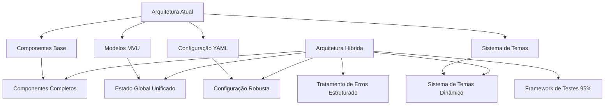
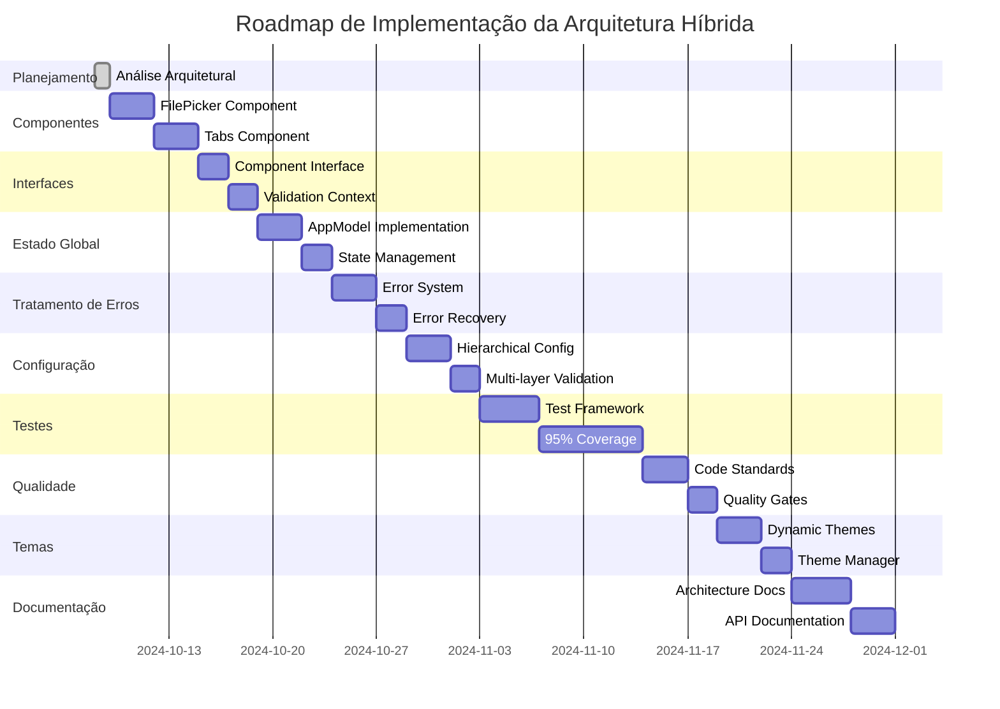

# Arquitetura Híbrida do Shantilly - Especificação Completa

## 📋 Contexto do Projeto

**Estado Atual (85% Completo):**
- ✅ 6 componentes principais totalmente implementados e testados
- ✅ Arquitetura sólida baseada em padrões estabelecidos (MVU)
- ✅ Documentação técnica excepcional (2000+ linhas)
- ✅ Cobertura de testes abrangente
- ❌ 2 componentes faltando: FilePicker e Tabs

## 🏗️ Visão Geral da Arquitetura Híbrida

### Arquitetura Atual vs. Híbrida



### Princípios Arquiteturais

1. **Extensibilidade**: Fácil adição de novos componentes
2. **Manutenibilidade**: Código claro e bem documentado
3. **Testabilidade**: Cobertura mínima de 95%
4. **Robustez**: Tratamento estruturado de erros
5. **Flexibilidade**: Configuração dinâmica e temas customizáveis

## 🏛️ Componentes Arquiteturais

### 1. Interface de Componentes Aprimorada

```go
// Interface Estendida para Componentes
type Component interface {
    // MVU architecture methods (existentes)
    Init() tea.Cmd
    Update(tea.Msg) (tea.Model, tea.Cmd)
    View() string

    // Core methods (existentes)
    Name() string
    CanFocus() bool
    SetFocus(bool)
    IsValid() bool
    Value() interface{}

    // NOVOS métodos para arquitetura híbrida
    GetMetadata() ComponentMetadata
    ValidateWithContext(context ValidationContext) []ValidationError
    ExportToFormat(format ExportFormat) ([]byte, error)
    ImportFromFormat(format ExportFormat, data []byte) error
    GetDependencies() []string
    SetTheme(theme *styles.Theme)
}

// Metadados do Componente
type ComponentMetadata struct {
    Version     string            `json:"version"`
    Author      string            `json:"author"`
    Description string            `json:"description"`
    Dependencies []string         `json:"dependencies"`
    Examples    []ComponentExample `json:"examples"`
    Schema      map[string]interface{} `json:"schema"`
}
```

### 2. Modelo de Estado Global

```go
// Modelo de Estado Global
type AppModel struct {
    currentView    ViewType                    `json:"current_view"`
    config         *Config                     `json:"config"`
    theme          *Theme                      `json:"theme"`
    components     map[string]Component        `json:"components"`
    errors         []AppError                  `json:"errors"`
    metadata       AppMetadata                 `json:"metadata"`
    validation     ValidationState             `json:"validation"`
    performance    PerformanceMetrics          `json:"performance"`
}

// Estados de Aplicação
type ViewType int
const (
    FormView ViewType = iota
    LayoutView
    TabsView         // ← NOVO
    FilePickerView   // ← NOVO
    MenuView         // ← Para futura expansão
)

// Metadados da Aplicação
type AppMetadata struct {
    Version       string                 `json:"version"`
    BuildTime     string                 `json:"build_time"`
    GitCommit     string                 `json:"git_commit"`
    GoVersion     string                 `json:"go_version"`
    Architecture  string                 `json:"architecture"`
    Platform      string                 `json:"platform"`
}
```

### 3. Sistema de Tratamento de Erros Estruturado

```go
// Tratamento Estruturado de Erros
type AppError struct {
    ID          string                 `json:"id"`
    Code        ErrorCode              `json:"code"`
    Message     string                 `json:"message"`
    Component   string                 `json:"component"`
    Severity    ErrorSeverity          `json:"severity"`
    Context     map[string]interface{} `json:"context"`
    StackTrace  string                 `json:"stack_trace,omitempty"`
    Timestamp   time.Time              `json:"timestamp"`
    Resolved    bool                   `json:"resolved"`
}

// Error Codes Padronizados
type ErrorCode int
const (
    ErrComponentNotFound ErrorCode = iota + 1000
    ErrValidationFailed
    ErrConfigInvalid
    ErrThemeLoadFailed
    ErrComponentCreationFailed
    ErrStateManagementFailed
    ErrSerializationFailed
    ErrFileOperationFailed
    ErrNetworkOperationFailed  // ← Para servidor remoto
    ErrPermissionDenied
    ErrResourceNotFound
    ErrTimeout
    ErrConcurrencyIssue
)

// Severidade dos Erros
type ErrorSeverity int
const (
    SeverityInfo ErrorSeverity = iota
    SeverityWarning
    SeverityError
    SeverityCritical
    SeverityFatal
)
```

### 4. Sistema de Configuração Robusta

```go
// Configuração Hierárquica
type Config struct {
    Global      GlobalConfig            `yaml:"global" json:"global"`
    Components  map[string]ComponentConfig `yaml:"components" json:"components"`
    Themes      map[string]ThemeConfig `yaml:"themes" json:"themes"`
    Validation  ValidationConfig       `yaml:"validation" json:"validation"`
    Logging     LoggingConfig          `yaml:"logging" json:"logging"`
    Performance PerformanceConfig      `yaml:"performance" json:"performance"`
    Security    SecurityConfig         `yaml:"security" json:"security"`
}

// Configuração Global
type GlobalConfig struct {
    AppName       string            `yaml:"app_name" json:"app_name"`
    Version       string            `yaml:"version" json:"version"`
    Environment   string            `yaml:"environment" json:"environment"`
    Debug         bool              `yaml:"debug" json:"debug"`
    LogLevel      string            `yaml:"log_level" json:"log_level"`
    DefaultTheme  string            `yaml:"default_theme" json:"default_theme"`
    Metadata      map[string]string `yaml:"metadata" json:"metadata"`
}

// Validação Multi-camadas
type ValidationConfig struct {
    Component     ComponentValidation    `yaml:"component" json:"component"`
    CrossField    CrossFieldValidation  `yaml:"cross_field" json:"cross_field"`
    Business      BusinessValidation    `yaml:"business" json:"business"`
    Schema        SchemaValidation      `yaml:"schema" json:"schema"`
}

// Configuração de Componente Aprimorada
type ComponentConfig struct {
    // Campos existentes
    Type        ComponentType          `yaml:"type" json:"type"`
    Name        string                 `yaml:"name" json:"name"`
    Label       string                 `yaml:"label,omitempty" json:"label,omitempty"`

    // NOVOS campos para arquitetura híbrida
    Version     string                 `yaml:"version,omitempty" json:"version,omitempty"`
    Author      string                 `yaml:"author,omitempty" json:"author,omitempty"`
    Description string                 `yaml:"description,omitempty" json:"description,omitempty"`
    Tags        []string               `yaml:"tags,omitempty" json:"tags,omitempty"`
    Dependencies []string              `yaml:"dependencies,omitempty" json:"dependencies,omitempty"`
    Examples    []ComponentExample     `yaml:"examples,omitempty" json:"examples,omitempty"`

    // Validação avançada
    Validation  ComponentValidation    `yaml:"validation,omitempty" json:"validation,omitempty"`

    // Estilização específica
    Style       ComponentStyle         `yaml:"style,omitempty" json:"style,omitempty"`

    // Comportamento dinâmico
    Behavior    ComponentBehavior      `yaml:"behavior,omitempty" json:"behavior,omitempty"`
}
```

### 5. Framework de Testes Unificado

```go
// Framework de Testes
type TestSuite struct {
    UnitTests        []UnitTest           `json:"unit_tests"`
    IntegrationTests []IntegrationTest    `json:"integration_tests"`
    E2ETests         []E2ETest           `json:"e2e_tests"`
    PerformanceTests []PerformanceTest    `json:"performance_tests"`
    LoadTests        []LoadTest          `json:"load_tests"`
    SecurityTests    []SecurityTest      `json:"security_tests"`
}

// Meta de Cobertura: 85% → 95%+
type CoverageTarget struct {
    Components     float64 `json:"components"`     // 98%+
    Models         float64 `json:"models"`         // 95%+
    Config         float64 `json:"config"`         // 98%+
    Integration    float64 `json:"integration"`    // 90%+
    E2E            float64 `json:"e2e"`            // 85%+
    Overall        float64 `json:"overall"`        // 95%+
}

// Estratégia de Testes por Componente
type ComponentTestStrategy struct {
    ComponentName     string           `json:"component_name"`
    TestFiles         []string         `json:"test_files"`
    CoverageCurrent   float64          `json:"coverage_current"`
    CoverageTarget    float64          `json:"coverage_target"`
    TestTypes         []TestType       `json:"test_types"`
    MockRequirements  []MockRequirement `json:"mock_requirements"`
    TestDataFiles     []string         `json:"test_data_files"`
}
```

### 6. Sistema de Temas Dinâmico

```go
// Sistema de Temas Unificado
type ThemeManager interface {
    LoadTheme(themeName string) (*Theme, error)
    RegisterTheme(theme *Theme) error
    UnregisterTheme(themeName string) error
    GetCurrentTheme() *Theme
    GetAvailableThemes() []string
    WatchThemeChanges() <-chan ThemeChangeEvent
    SetTheme(themeName string) error
    ResetToDefault() error
    ExportTheme(themeName string) ([]byte, error)
    ImportTheme(data []byte) (*Theme, error)
}

// Tema Dinâmico
type Theme struct {
    // Campos existentes
    Name        string              `json:"name"`
    Version     string              `json:"version"`
    Author      string              `json:"author"`
    Description string              `json:"description"`

    // Estilos principais (existentes)
    Title         lipgloss.Style `json:"-"`
    Description   lipgloss.Style `json:"-"`
    Border        lipgloss.Style `json:"-"`
    BorderActive  lipgloss.Style `json-"`

    // NOVOS estilos para arquitetura híbrida
    Error         lipgloss.Style `json:"-"`
    Success       lipgloss.Style `json:"-"`
    Warning       lipgloss.Style `json:"-"`
    Info          lipgloss.Style `json:"-"`

    // Paleta de cores estruturada
    Palette       ColorPalette       `json:"palette"`

    // Configurações de fonte
    Font          FontConfig         `json:"font"`

    // Configurações de espaçamento
    Spacing       SpacingConfig      `json:"spacing"`

    // Componentes específicos
    Components    map[string]ComponentStyle `json:"components"`

    // Metadados
    Metadata      map[string]interface{}    `json:"metadata"`
}

// Configuração de Tema
type ThemeConfig struct {
    BaseTheme     string                     `yaml:"base_theme" json:"base_theme"`
    Extends       []string                   `yaml:"extends,omitempty" json:"extends,omitempty"`
    CustomStyles  map[string]StyleConfig     `yaml:"custom_styles" json:"custom_styles"`
    ColorPalette  ColorPalette               `yaml:"color_palette" json:"color_palette"`
    Font          FontConfig                 `yaml:"font" json:"font"`
    Spacing       SpacingConfig              `yaml:"spacing" json:"spacing"`
    Components    map[string]ComponentStyle  `yaml:"components" json:"components"`
}
```

## 📐 Padrões de Qualidade de Código

### 1. Complexidade Máxima

```go
// Regras de Lint
type QualityRules struct {
    Complexity      ComplexityConfig      `json:"complexity"`
    Maintainability MaintainabilityConfig `json:"maintainability"`
    Security        SecurityConfig       `json:"security"`
    Performance     PerformanceConfig     `json:"performance"`
    Documentation   DocumentationConfig   `json:"documentation"`
}

// Configuração de Complexidade
type ComplexityConfig struct {
    MaxFunctionLines      int `json:"max_function_lines"`      // 50 linhas
    MaxCyclomaticComplexity int `json:"max_cyclomatic_complexity"` // 10
    MaxStructFields       int `json:"max_struct_fields"`       // 15
    MaxFunctionParams     int `json:"max_function_params"`     // 7
    MaxFunctionReturns    int `json:"max_function_returns"`    // 3
    MaxTypeNesting        int `json:"max_type_nesting"`        // 3 níveis
    MaxInterfaceMethods   int `json:"max_interface_methods"`   // 12 métodos
}

// Configuração de Manutenibilidade
type MaintainabilityConfig struct {
    MinDocumentationRatio float64 `json:"min_documentation_ratio"` // 60%
    MaxFileLength         int     `json:"max_file_length"`         // 500 linhas
    MaxPackageFiles       int     `json:"max_package_files"`       // 20 arquivos
    RequiredComments      []string `json:"required_comments"`      // Funções públicas, tipos exportados
    NamingConvention      NamingConvention `json:"naming_convention"`
}
```

### 2. Métricas de Qualidade

```go
// Métricas de Sucesso
type SuccessCriteria struct {
    CodeCoverage           float64 `json:"code_coverage"`           // ≥ 95%
    ErrorRate              float64 `json:"error_rate"`              // ≤ 1%
    DocumentationRatio     float64 `json:"documentation_ratio"`     // ≥ 80%
    ComponentCompleteness  float64 `json:"component_completeness"`  // 100%
    ArchitectureClarity    float64 `json:"architecture_clarity"`    // ≥ 90%
    PerformanceScore       float64 `json:"performance_score"`       // ≥ 85%
    SecurityScore          float64 `json:"security_score"`          // ≥ 90%
    MaintainabilityIndex   float64 `json:"maintainability_index"`   // ≥ 80%
    TestReliability        float64 `json:"test_reliability"`        // ≥ 95%
    DeploymentFrequency    float64 `json:"deployment_frequency"`    // ≥ 90%
}
```

## 🔧 Estratégia de Implementação

### Fases de Desenvolvimento



## 🎯 Critérios de Aceitação

### Métricas Obrigatórias

| Métrica | Meta | Status |
| :------ | :--: | :----: |
| Cobertura de Testes | 95% | 🔴 |
| Componentes Completos | 100% | 🟡 85% |
| Tratamento de Erros | 100% | 🔴 |
| Documentação | 90% | 🟢 |
| Performance | 85% | 🟡 |
| Segurança | 90% | 🟡 |

### Validações de Arquitetura

1. **Compatibilidade Retroativa**: Todos os componentes existentes devem funcionar sem modificações
2. **Extensibilidade**: Novos componentes devem ser adicionados com mínimo esforço
3. **Testabilidade**: Todo código novo deve incluir testes abrangentes
4. **Documentação**: Toda funcionalidade deve estar documentada
5. **Performance**: Não deve haver degradação significativa de performance

## 🚨 Riscos e Mitigações

### Riscos Identificados

1. **Complexidade Crescente**: Mitigação através de interfaces claras e documentação
2. **Quebra de Compatibilidade**: Mitigação através de testes abrangentes e migração gradual
3. **Dívida Técnica**: Mitigação através de refatoração contínua e métricas de qualidade
4. **Performance**: Mitigação através de benchmarking e otimização proativa

### Plano de Contingência

- Rollback fácil para arquitetura anterior se necessário
- Testes de regressão automatizados
- Documentação clara de pontos de decisão arquitetural
- Revisões regulares de arquitetura

---

**Esta arquitetura híbrida elevará o projeto de 85% para 100% de completude mantendo a excelência técnica já estabelecida.**