### Especificação Arquitetural: Shantilly Híbrido CLI/Servidor

#### 1. Introdução e Propósito

Este documento define a arquitetura de software canônica para o projeto Shantilly, uma aplicação CLI (Command Line Interface) construída em Go que utiliza o ecossistema Charm (Bubble Tea, Lip Gloss e Bubbles). O objetivo primário é estabelecer uma estrutura modular coesa e um fluxo de controle rígido para suportar o desenvolvimento híbrido (TUI local e TUI via servidor SSH), prevenindo a incoerência estrutural e a duplicação de funcionalidade observadas em fases iniciais do projeto.

Esta arquitetura serve como *blueprint* e **Guard Rail** para o desenvolvimento conduzido por Inteligência Artificial, exigindo o alinhamento estrito com o princípio de *Separation of Concerns* (Separação de Preocupações) Go-Native.

#### 2. Estrutura Modular e Separação de Responsabilidades

O Shantilly deve aderir rigorosamente à estrutura de pacotes Go (`cmd/`, `internal/`), conforme o padrão Go/Charm. A separação funcional é mandatória para garantir que a lógica de negócio (Estado/Orquestração) seja distinta da lógica de interface (Widgets) e da camada de entrada (CLI/Servidor).

| Diretório              | Pacotes Chave                                         | Responsabilidade                                                                                                                                            | Regras Obrigatórias para a IA                                                                                                |
|:---------------------- |:----------------------------------------------------- |:----------------------------------------------------------------------------------------------------------------------------------------------------------- |:---------------------------------------------------------------------------------------------------------------------------- |
| `cmd/`                 | `root`, `form`, `menu`, `layout`, `tabs`, **`serve`** | Ponto de entrada da aplicação. Lógica Cobra (flags, parsing). Inicialização do `tea.Program` ou do servidor `wish`.                                         | Deve conter apenas lógica de CLI, configuração e iniciação. **Nenhuma lógica de `Update()` ou `View()` de TUI é permitida.** |
| `internal/models/`     | `FormModel`, `LayoutModel`, `TabsModel`               | **Orquestração de Estado**. Implementa o padrão `tea.Model` (Model-Update-View). Gerencia a navegação de foco, validação agregada e delegação de mensagens. | Modelos devem ser **agnósticos ao I/O** (não devem saber se a execução é local ou remota).                                   |
| `internal/components/` | `textinput`, `slider`, `radiogroup`                   | **Widgets de UI**. Implementa a interface `Component`. Responsável pelo estado do widget, renderização (`View()`) e validação individual (`IsValid()`).     | Deve maximizar o reuso de `charmbracelet/bubbles` (ex: `textarea`, `filepicker`).                                            |
| `internal/styles/`     | `theme`                                               | Estilização declarativa usando Lip Gloss.                                                                                                                   | Deve conter apenas definições de `lipgloss.Style`.                                                                           |
| `internal/config/`     | `types`                                               | Definição das estruturas de dados (structs) para as configurações YAML/JSON e lógica de validação inicial de tipos.                                         | Deve garantir que o `yaml.Unmarshal` use tags e tratamento de erro explícito.                                                |

#### 3. Fluxo Híbrido: CLI Local e Servidor SSH (Wish)

O comando raiz (`shantilly`) deve utilizar o `github.com/spf13/cobra` para gerenciar todos os subcomandos e o novo modo de servidor. A arquitetura deve ser dividida em dois grupos funcionais de alto nível: **TUI Local** e **TUI Servidor**.

##### 3.1. Grupo de Comandos TUI Local (Cobra)

Estes comandos utilizam a execução padrão do Bubble Tea, rodando diretamente no terminal do usuário.

| Comando                          | Uso                                   | Fluxo de Execução                                                                                                  |
|:-------------------------------- |:------------------------------------- |:------------------------------------------------------------------------------------------------------------------ |
| `shantilly form [config.yaml]`   | TUI interativa para formulários.      | `cmd/form.go` -> Decodifica YAML -> `models.NewFormModel` -> `tea.NewProgram(model).Run()` -> Processa saída JSON. |
| `shantilly menu [config.yaml]`   | TUI interativa para menus de seleção. | Fluxo análogo ao `form`, utilizando `models.NewMenuModel`.                                                         |
| `shantilly layout [config.yaml]` | Renderiza layouts estruturados.       | Fluxo análogo ao `form`, utilizando `models.NewLayoutModel`.                                                       |
| `shantilly tabs [config.yaml]`   | Renderiza interfaces com abas.        | Fluxo análogo ao `form`, utilizando `models.NewTabsModel`.                                                         |
| `shantilly version`              | Informações de compilação.            | Execução simples sem TUI.                                                                                          |

##### 3.2. Novo Comando TUI Servidor (Wish)

A nova funcionalidade de servidor deve ser isolada em um subcomando dedicado, utilizando o `github.com/charmbracelet/wish` para expor a aplicação TUI via SSH.

| Comando           | Uso                           | Fluxo de Execução                                                                                      |
|:----------------- |:----------------------------- |:------------------------------------------------------------------------------------------------------ |
| `shantilly serve` | Inicia o servidor SSH/daemon. | `cmd/serve.go` (Novo) -> `wish.NewServer` -> Aplica `bubbletea middleware` -> Inicia o loop de escuta. |

###### Fluxo de Execução Híbrido (Diagrama Simplificado)

```mermaid
graph TD
    A[Usuário: shantilly <comando> <config>] --> B{cmd/root.go: Cobra};

    subgraph TUI LOCAL
        B --> C1(cmd/form, menu, layout);
        C1 --> C2[Lê Config YAML];
        C2 --> D1(internal/models: Cria Model);
        D1 --> E1[tea.NewProgram.Run() local];
        E1 --> F1[TUI Interativa (Terminal Local)];
    end

    subgraph TUI SERVIDOR (WISH)
        B --> C3(cmd/serve.go: Inicia Servidor Wish);
        C3 --> D2[Servidor SSH (Wish)];
        D2 --> E2[Middleware bubbletea (por Sessão)];
        E2 --> D1;
        D1 --> F2[tea.NewProgram.Run() remoto];
        F2 --> G2[TUI Interativa (Cliente SSH)];
    end
```

###### Fluxo de Execução Híbrido (Diagrama Detalhado)

O fluxo apresentado no diagrama Mermaid representa de forma **altamente precisa e estruturalmente correta** a **Arquitetura Híbrida CLI/Servidor** do projeto Shantilly, conforme definido no *Blueprint Arquitetural Híbrido* e na *Especificação do Modo Servidor* (`docs/dev/Architecture.md` e `docs/dev/Server_Design.md`).

O diagrama reflete a separação rigorosa de responsabilidades exigida, onde a lógica da TUI (`internal/models/`) é agnóstica ao I/O, e o `cmd/` gerencia o ponto de entrada (local ou remoto).

Abaixo está a validação dos fluxos com base nas especificações do projeto:

### 1. Fluxo TUI Local (shantilly form, menu, layout)

O fluxo local está totalmente alinhado com a arquitetura CLI/TUI nativa do Shantilly, que utiliza Cobra e Bubble Tea.

*   **Comando Raiz (Cobra):** O `shantilly` invoca o Cobra (`ROOT`).
*   **Subcomando (Form/Menu/Layout):** Comandos como `form`, `menu`, `layout` são subcomandos Cobra definidos em `cmd/*.go`. Eles leem a configuração (`CFG` - YAML).
*   **Criação do Modelo (MODEL):** A leitura da configuração leva à criação do `tea.Model` apropriado (ex: `FormModel` em `internal/models/`).
*   **Execução Local (PROG):** O comando CLI então inicia o ciclo de eventos do Bubble Tea localmente com `tea.NewProgram(model).Run()` (geralmente com `tea.WithAltScreen()`).

### 2. Fluxo TUI Servidor (SSH/Wish)

O fluxo de servidor detalhado no diagrama é o método arquiteturalmente correto para estender o Shantilly para o SSH, usando o Charm Wish.

*   **Subcomando Dedicado (SERVEGO):** O modo servidor deve ser isolado em um subcomando, como `shantilly serve` (`SERVEGO`), o que garante que a funcionalidade do servidor seja uma **extensão limpa da CLI**.
*   **Inicialização do Wish (WS):** O `cmd/serve.go` é responsável por iniciar o `wish.NewServer`.
*   **Middleware Bubble Tea (MIDDLE):** O `wish` utiliza o `bubbletea middleware`, que é a peça chave que permite servir **qualquer aplicação Bubble Tea sobre SSH**.
*   **Loop de Escuta (LOOP):** O servidor SSH fica em um *loop* de escuta.
*   **Execução Remota (REMPROG):** Para cada sessão SSH, o *middleware* cria um novo `tea.Program` (`REMPROG`). Crucialmente, a **Camada de Orquestração** (`internal/models/`) fornece o `Model` neste ponto, sem precisar saber que está sendo executado remotamente, cumprindo o requisito de **agnosticismo de I/O**.

O fluxo do diagrama representa o modelo de composição do Charm: Cobra delega o controle para a execução TUI, que é então abstraída pelo Bubble Tea e, no caso remoto, pelo Wish.

```mermaid
---
config:
  layout: fixed
---
flowchart TD
    subgraph TUI_LOCAL["TUI Local"]
        CLI["Usuário executa: shantilly"] 
        ROOT["Comando raiz (Cobra)"]
        FORM["Exibe Form/Menu/Layout"]
        CFG["Lê config YAML"]
        MODEL["Cria Model"]
        PROG["tea.NewProgram.Run local"]
        TUI["TUI Interativa (Terminal Local)"]
        CLI --> ROOT --> FORM --> CFG --> MODEL --> PROG --> TUI
    end

    subgraph TUI_SERVIDOR_WISH["TUI Servidor (SSH/Wish)"]
        SERVE["Usuário executa: shantilly serve"]
        SERVEGO["cmd/serve.go (Novo subcmd)"]
        WS["wish.NewServer"]
        MIDDLE["Aplica bubbletea middleware"]
        LOOP["Loop de escuta do servidor SSH"]
        REMPROG["tea.NewProgram.Run remoto"]
        TUISSH["TUI Interativa (via SSH)"]
        SERVE --> SERVEGO --> WS --> MIDDLE --> LOOP
        LOOP --> REMPROG --> TUISSH
    end
```



#### 4. Princípios Arquiteturais e Coerência Estrutural

A IA deve seguir as seguintes diretrizes para garantir a **maximalização da especificação declarativa e da automação rigorosa da qualidade**:

##### 4.1. Contrato de Componentes (`Component Interface`)

**A coerência estrutural é priorizada sobre a velocidade de implementação.**. A definição completa de interfaces-chave deve preceder qualquer lógica individual de componente.

* A interface `Component` deve ser implementada completamente por todos os widgets em `internal/components/`.
* Métodos cruciais como `CanFocus()`, `IsValid()`, `Value()` e `GetError()` são os contratos de qualidade que definem a interoperabilidade dos componentes com os modelos de orquestração (ex: `FormModel.CanSubmit()`).
* A IA deve garantir que não haja duplicação de responsabilidades: a lógica de navegação principal (tab/shift+tab) pertence ao `LayoutModel` ou `FormModel`, e a lógica de entrada individual (teclas de digitação/movimento) pertence ao componente focado (`Component.Update`).

##### 4.2. Tratamento de Erros Explícito e Rigoroso

Para desviar dos problemas de validação tardia e avisos de `errcheck`, o tratamento de erros deve ser explícito e contextualizado:

* **Padrão de Erro:** Todo retorno de erro em operações de I/O, `yaml.Unmarshal` ou inicialização de modelo deve usar `fmt.Errorf("mensagem de contexto: %w", err)`.
  * *Exemplo:* `yaml.Unmarshal` falhando em `cmd/*.go` deve adicionar o contexto da falha.
* **Zero Tolerância:** O `errcheck` deve ser configurado como **fatal** nas regras de linting.

##### 4.3. Estilização Agnóstica e Remota

Os modelos devem ser agnósticos ao ambiente de I/O. A estilização deve ser responsiva e adaptável:

* **Custom Renderers:** No `cmd/serve.go` (modo Wish), a inicialização do `tea.Program` e a renderização do Lip Gloss **devem** usar `lipgloss.NewRenderer(ssh.Session)` ou equivalente. Isso garante que as cores e estilos sejam adaptados ao terminal remoto, detectando o perfil de cor e o status de fundo escuro (`HasDarkBackground`) do cliente SSH.
* **Layout:** O `LayoutModel` deve continuar a usar `lipgloss.JoinHorizontal` e `lipgloss.JoinVertical` para posicionamento responsivo.
